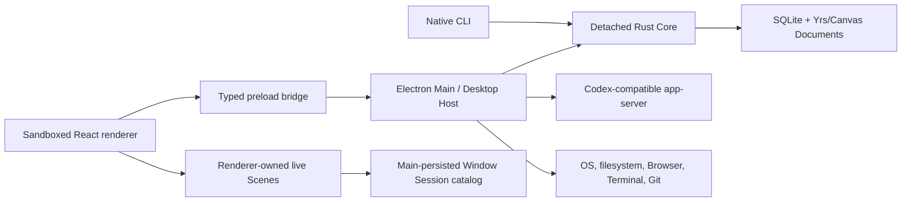
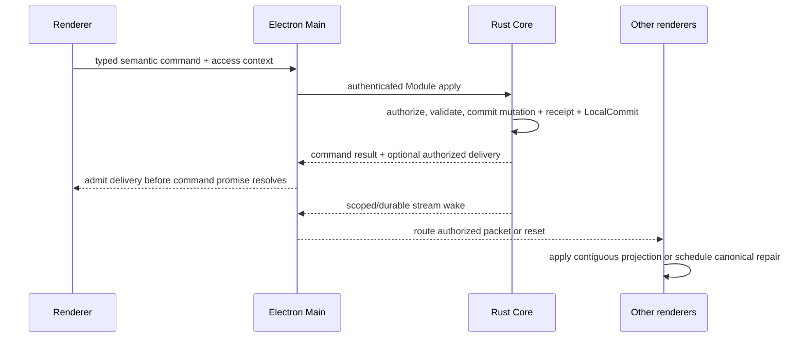

# Architecture

This document is the compact map of Nodex's system boundaries, state owners, dependency directions, and system-wide invariants. It answers four questions:

1. Which Module owns a piece of state or behavior?
2. Which boundary may mutate it?
3. How may the major runtimes depend on one another?
4. Where is the detailed contract documented?

It is deliberately not a file inventory, migration ledger, product specification, or reliability runbook. See [Documentation ownership](#documentation-ownership) before adding detail.

## System at a glance

Nodex is a local-first, block-based agent orchestrator. One detached native Rust Core is the exclusive SQLite and collaborative-document authority for a Profile. Electron is the Desktop Host: it supervises Core, owns windows and operating system integration, hosts the Codex-compatible app-server and other external runtimes, and exposes typed capabilities to sandboxed renderers. The native CLI reaches the same Core contracts without going through Electron.



The principal dependency rule is inward ownership:

```text
Renderer -> Preload -> Electron Main adapters -> Core protocol -> Core Modules
Native CLI -------------------------------> Core protocol -> Core Modules

Core Modules -> domain/infrastructure
Core server  -> protocol + Core Modules

Never:
Renderer -> SQLite / Node / Core internals
Electron Main -> nodex.db / Yrs transaction reconstruction
Core Modules -> Electron / renderer / transport presentation
```

## Domain and authority model

The canonical vocabulary and full domain invariants live in [CONTEXT.md](CONTEXT.md). This section records only the ownership relationships needed to navigate the system.

### Content and execution are separate

```text
Profile
└── Library                         durable content scope
    ├── Block                       persistent content identity
    ├── Page                        document-bearing Block
    │   └── Document                synchronized title/body authority
    ├── Canvas                      document-bearing Block
    │   └── Document                scene authority
    └── Database                    placeable Container Block
        ├── Page-key namespace      readable alias registry + counter
        ├── Data Source             schema + Page rows + typed Property values
        └── View                    presentation over one Data Source

Project                              execution context
├── primary Database binding
├── explicit Library resource grants
├── filesystem sources
└── Sessions / Threads / terminals / approval policy
```

One Profile owns one Library. Library owns durable content; Project owns execution context and access to content. Archiving or deleting a Project never owns, moves, or deletes Library content.

Blocks, Documents, owner registries, search/asset projections, and top-level placement are physically Library-scoped. A Project coordinate retained by a receipt, change log, automation record, recovery artifact, or delivery packet names actor/execution/delivery provenance, not content ownership. `library_block_placements` is the sole root-order authority; runtime mutations do not dual-write a Project-local placement graph.

Every active Page has exactly one `library | page | data_source` parent. Page ownership forms an acyclic forest. References, mentions, backlinks, relations, and Views are non-owning and do not expand authorization. Page ID is Block ID; Document identity remains independent.

A top-level Canvas is authorized by an explicit generic Canvas resource grant. An embedded Canvas inherits the host Page authorization path and has no active direct Canvas grant. Moving between Library and Page placement changes that grant state atomically with the host shell and never rehomes content.

A Database is a Container Block that owns Data Sources and Views. An enabled Database also owns one Page-key namespace whose Library-unique prefix history, monotonic counter, and immutable Database/Page assignments provide readable aliases without replacing Page UUID identity. A Data Source owns its schema, row Pages, typed Property values, and query identity. Its fixed `task_parent` Property is a cardinality-one self-Relation; the Relation value header is the sole concurrency authority for roots and children, and only its edge may carry sibling rank. The resulting task hierarchy is non-owning presentation semantics: it never changes a Page's structural `library | page | data_source` parent or expands authorization, and there is no parallel hierarchy graph. A View targets exactly one Data Source and owns its durable Filter, default presentation, and one View-global Page rank. Per-View Profile state has two independent authorities: a revision-fenced sparse Board/List presentation and a bounded set of typed collapsed occurrences changed by idempotent per-target patches. Their delivery atoms require View read authorization but carry no shared projection coordinates, so personal changes converge without invalidating View content or Library navigation. The Rust Database Module contract owns the complete typed View-definition grammar and a tagged read command for each legal coordinate set; identity descriptors are typed responses, so unrelated target, window, group, and Page-ID parameters cannot cross the Core boundary. SQLite schema markers and canonical JSON are storage encoding, while Main and renderer casing and compatibility envelopes are explicit mechanical projections rather than parallel domain grammars. Core normalizes the effective presentation against Data Source capabilities before query execution. Board consumes its established bounded group windows. List consumes a dedicated grouped/nested occurrence window whose complete Core projection graph also resolves semantic subtree moves; the renderer's bounded window owns pointer preview only and never expands descendants or composes authoritative Property, Parent, or order writes. Both layouts commit through the same atomic Database boundary. These identities are independent and must not be derived from one another.

The decisions behind this model are recorded in [ADR 0017](docs/adr/0017-library-pages-data-sources-and-project-resource-grants.md), [ADR 0020](docs/adr/0020-database-identity-scopes.md), [ADR 0039](docs/adr/0039-data-source-relation-properties-and-property-semantics.md), and [ADR 0043](docs/adr/0043-database-scoped-page-keys.md).

### State authority table

| State or capability                                                     | Authoritative owner                                                          | Adapters and projections                                                                                                                         |
| ----------------------------------------------------------------------- | ---------------------------------------------------------------------------- | ------------------------------------------------------------------------------------------------------------------------------------------------ |
| Blocks, Pages, Databases, Documents, search, schedules, history         | Rust Core Library/Database/Document Modules                                  | Core protocol, Electron adapters, CLI, renderer read models                                                                                      |
| Page-key namespaces, prefix history, counters, assignments              | Rust Core Database Module                                                    | Contextual Core projections; CLI/Agent resolve to canonical Page IDs                                                                             |
| Projects, Sessions, durable Thread metadata, execution context          | Rust Core Workspace Module                                                   | Electron Codex/Workspace services and renderer queries                                                                                           |
| Project access to Library resources                                     | Rust Core Library authorization and resource-grant boundary                  | Workspace supplies Project identity; Electron and CLI bind access context                                                                        |
| Automation definitions, runs, occurrences, reminder leases and receipts | Rust Core Automation Module                                                  | Electron scheduler/executor and renderer queries                                                                                                 |
| Backups, restore, retention, Store maintenance                          | Rust Core Administration Module                                              | Electron administration adapter and controlled relaunch                                                                                          |
| Active Codex conversation document                                      | Current renderer owner, seeded from app-server state                         | Main holds a validated relay/recovery replica; followers render validated copies                                                                 |
| Codex wire protocol and remote Thread observations                      | Pinned Codex-compatible app-server                                           | Main validates and routes generated protocol envelopes                                                                                           |
| Managed worktree creation and lifecycle                                 | Electron Main lifecycle coordinator and the worktree's execution-host worker | Renderer projects typed pending/availability/inventory state; Core persists only durable execution location and Session/Thread/worktree metadata |
| Window layout, owner-scoped Scenes, surface placement                   | Renderer Window Session App aggregate                                        | Main persists the revisioned Window Session catalog                                                                                              |
| Browser guests, Browser Use, MCP App guests, Terminal processes         | Electron Main runtime aggregates                                             | Renderer holds presentation descriptors and host bindings only                                                                                   |
| Git repository live-read state                                          | Main-owned Git worker process                                                | Typed Main/preload bus and renderer query projections                                                                                            |
| Preferences, managed asset files, logs, OS notifications                | Electron Main local/OS adapters                                              | Typed renderer IPC; managed assets use immutable atomic publication outside backup staging, while durable semantic content remains in Core       |

Authority and presentation are intentionally different. A Scene can present a Page without owning it; a renderer cache can display a Database window without authorizing it; Main can relay a Codex document without becoming its visible writer.

Page discovery is one Core-owned capability across Page references, Command Palette search, Agent search, and transport clients. Core maintains the durable projection, applies lifecycle, scope, authorization, and typed filters before the result bound, and returns complete ordering plus typed match evidence. Interactive renderers may hold only a commit-fenced, Core-authored metadata projection and query it synchronously with the same Rust search kernel compiled to WASM; Store-epoch or authorization-scope changes revoke that projection immediately. Body evidence and historical-key resolution remain asynchronous Core enrichment. Adapters translate contracts mechanically, and renderers do not define a second normalization, fuzzy, ranking, or highlighting policy. User-visible policy belongs to [Command Palette Behavior](product-specs/command-palette-behavior.md) and [NFM Editor Page Connection Behavior](product-specs/nfm-editor-page-reference-behavior.md).

## Runtime boundaries

### Native Core

The Rust Core is the only production authority allowed to open `nodex.db`, write the WAL, reconstruct durable Yrs/Canvas Documents, execute semantic transactions, advance projections, or maintain receipts and history. It runs as one detached process per Profile and exposes authenticated HTTP/1.1 over a Profile-private Unix socket.

Core is organized as six deep semantic Modules under [`crates/nodex-core/src`](crates/nodex-core/src):

| Module         | Owns                                                                             |
| -------------- | -------------------------------------------------------------------------------- |
| Library        | Block/Page ownership, navigation, lifecycle, content operations, resource grants |
| Database       | Database/Data Source/View schema, values, relations, queries, and positions      |
| Document       | Yrs/Canvas persistence, live sync, versions, and content operations              |
| Workspace      | Projects, Sessions, Threads, sidebar order, execution metadata                   |
| Automation     | Definitions, schedules, runs, occurrences, reminders, leases                     |
| Administration | Backup, restore, retention, compaction, Store maintenance                        |

Each public Module presents a versioned `read`/`apply` Interface in [`crates/nodex-core-contracts`](crates/nodex-core-contracts). Module implementations may share internal transaction kernels, but callers may not compose several public Module calls and call the result atomic. A cross-domain mutation belongs to one owning aggregate that invokes the other domain seams inside the same Core transaction.

[`crates/nodex-core-protocol`](crates/nodex-core-protocol) owns authenticated transport envelopes, compatibility negotiation, generated OpenAPI artifacts, event versions, and bounded codecs. [`crates/nodex-core-server`](crates/nodex-core-server) owns socket transport, connections, process lifecycle, stream admission, and health metrics. Transport code depends on semantic contracts; semantic Modules never depend on transport code.

Core Server also owns one request-execution boundary for synchronous Module work. It admits bounded `interactive`, `background`, and `maintenance` classes, preserves capacity for interactive requests, runs admitted work outside async transport workers, and carries one absolute deadline and cancellation token through reader checkout, writer queueing, and SQLite execution. Electron supplies request identity and intent but does not decide when Core work has actually stopped. A semantic deadline, caller cancellation, admission overload, and authority/transport loss are distinct typed outcomes.

That class continues through the serialized Store writer rather than ending at request admission. The writer prefers interactive commands, ages bounded background/maintenance work for fairness, promptly evicts interrupted queued commands, and checks the same cancellation/deadline again across dequeue races. Maintenance owns resumable orchestration and must yield through short writer commands; read-heavy planning belongs on a consistent reader snapshot with an explicit writer-side authority fence. A transaction boundary hidden inside one long writer closure is not a scheduling boundary.

Store formats and migration sequences are implementation/recovery contracts, not architecture prose. Their executable authority is under [`crates/nodex-core/src/infrastructure`](crates/nodex-core/src/infrastructure), [`crates/nodex-core/schema`](crates/nodex-core/schema), and the corresponding Core tests. Operational expectations belong in [Reliability](docs/RELIABILITY.md).

### Electron Main / Desktop Host

[`src/main`](src/main) owns the non-transactional desktop boundary:

- Core selection, authenticated connection, compatibility checks, supervision, and recovery through [`src/main/core-client`](src/main/core-client).
- Trusted identity binding and strict mapping between renderer/Host contracts and Core Module contracts.
- BrowserWindow, preload, IPC, application menus, deep links, clipboard, notifications, assets, logs, and platform integration.
- Codex app-server lifecycle, request routing, runtime configuration, and external agent execution.
- Browser, MCP App, Computer Use, Terminal, Git, worktree, and filesystem runtime aggregates.
- Revisioned Window Session catalog persistence and restore policy.

Main is an Adapter, coordinator, and runtime host. It may bind Profile/Library/Project/Session identity, perform host preflight, and coordinate external effects around a Core command. It must not open SQLite, reconstruct a semantic transaction, infer authorization from renderer state, or provide a fallback data authority when Core is unavailable.

Electron Main is one Effect 4 application kernel. [`MainEntry`](../src/main/app/MainEntry.ts) is the Main-process Node runtime root; [`MainApp`](../src/main/app/MainApp.ts) owns ready, bootstrap handoff, shutdown admission, and the process Scope; [`MainDesktopRuntimeLive`](../src/main/app/MainDesktopRuntimeLive.ts) composes the Core, Codex, Window, IPC, and host Layers. Startup rollback and every normal or authority-driven quit close that same Scope. Physical Core generations, Codex app-server sessions, windows, workers, PTYs, file watchers, and callback fibers are subordinate scoped resources rather than parallel lifecycle owners. Worker and standalone script processes have their own explicitly allowlisted `NodeRuntime.runMain` entries and never share Main's runtime.

Foreground Appshot discovery is one process-scoped host runtime. Windows only
contribute focus observations; closing a window or Main releases its listeners,
target handles, in-flight helper read, and polling fiber through that runtime's
Scope. One immutable `Ref` owns focus and target state, concurrent reads share
one cached Effect, and a `FiberHandle` starts or interrupts foreground polling.
The native Adapter owns only helper execution, screen metadata, and Electron
capture calls; it has no scheduler or application state. Renderer IPC borrows
the runtime and never owns a second cache or scheduler.

Remote Hosted PiP likewise keeps its native presentation poll in one scoped
Effect fiber. The native host coordinator contains no timer; it tracks every
window focus/closed and WebContents destroyed listener by Window identity and
removes the whole registration on window removal or Main Scope release. Gateway
notifications and Browser Use refresh signals enter the same runtime owner.

Browser Use sessions are a process-scoped keyed resource family. An infinite-idle
`LayerMap` owns one IAB API, native pipe server, CDP listener, and turn sequencer per
captured route generation; session release, renderer-owner release, provisional-route
replacement, and Main shutdown invalidate that exact generation. Route mutation is
single-writer and every turn completes through the session's own semaphore. Browser
Use application Modules exchange typed Effects; Promise exists only at the sidebar
route callback and native pipe/API adapters, where callback fibers belong to the
session or installation Scope. Native-pipe commands pass through the session's
single command admission semaphore. IAB deadlines, capture polling sleeps, cursor
arrival, and WebContents attachment waits borrow the session Effect clock and
callback runtime, so closing the session interrupts waits and removes registrations;
the IAB state machine contains no EventEmitter, timer, or detached Promise waiter.

Browser site-status policy is a Browser Profile-scoped Effect runtime, not an HTTP client or a
Sidebar-owned cache. It borrows authenticated requests from `ChatGptDesktop`, keeps only valid
hostname decisions in a `Ref`, and coalesces each hostname's in-flight lookup in a scoped
`FiberMap`; malformed and failed responses fail open without entering the cache. The synchronous
cache read and Promise callback exposed to Browser Sidebar are projections of that owner, and
closing the Browser Profile interrupts all pending lookups.

Browser Use approval policy is owned by the same Browser Profile but remains a distinct typed
runtime. A single semaphore serializes policy mutations; each mutation builds an immutable next
state, atomically publishes TOML through a synced staging file and directory rename, and only then
commits the in-memory `Ref`. Browser Use borrows the synchronous policy projection, while renderer
IPC invokes the mutation Effects directly. Corrupt policy files are quarantined during acquisition;
there is no Promise write queue or second policy store in the Sidebar graph.

Browser downloads are another Browser Profile-scoped runtime. Electron's synchronous
`will-download` callback performs identity validation, one-shot agent-grant consumption, and save
path assignment before returning; accepted progress then enters a scoped FiberSet. One immutable
state projection owns live items and history, and one serialized Effect lane atomically publishes
the bounded JSON history. Scope release removes session ingress, interrupts callback fibers, clears
ephemeral grants and live handles, and leaves completed files untouched. IPC calls typed download
Effects directly; Browser Sidebar receives only a tracked `clearHistory` Promise projection.

Browser credentials and contact information share one Browser Profile-scoped Effect runtime. Its
immutable candidate `Ref` and single semaphore own candidate expiry, renderer-owner release, and all
credential/contact mutations; Profile release clears candidate plaintext. The encrypted vault is a
stateless synchronous security adapter for Electron `safeStorage` and atomic filesystem publication,
not an application service or a second write queue. Renderer and guest IPC invoke the runtime's typed
Effects directly, and decrypted values are sent only after revalidating the exact guest and HTTP(S)
origin.

Browser Profile import is a separate Profile-scoped runtime. The Main bootstrap supplies immutable
platform, home-directory, environment, and helper-path inputs; discovery never rereads ambient
configuration. One semaphore admits an import only after rediscovering and canonicalizing its source,
and the helper process is a scoped `ChildProcessSpawner` resource with bounded output and an Effect
deadline. Imported cookies enter only Electron's Profile cookie store, while passwords enter the same
credential mutation lane used by every other Browser credential write. Neither the helper nor the
importer owns a second vault, write queue, child-process registry, or timer.

Browser extension and site-information operations are stateless Profile capabilities, not a generic
service aggregate. The Profile exposes their typed Effects directly: filesystem/Electron extension
failures and cookie-store failures remain in the Effect channel until IPC maps them once. Synchronous
capability checks stay pure, while Electron's Promise APIs are confined to the operation Adapter; no
Promise provider object or duplicate Profile facade owns these calls.

Browser local-server display preferences are Profile-owned state, not a renderer or IPC cache. Their
runtime loads and validates one bounded JSON file, quarantines malformed input, and serializes partial
updates through one semaphore. A mutation atomically publishes and fsyncs the complete next document
before committing its `Ref`, so concurrent partial updates cannot overwrite one another and a failed
write cannot advance the visible snapshot. IPC reads and mutates this runtime directly.

Local-server thumbnails belong to the Browser Sidebar runtime rather than the Sidebar state machine.
An Effect Cache provides bounded TTL and same-URL single-flight, a semaphore bounds capture
concurrency, and a scoped FiberSet owns queued and active captures. Each hidden BrowserWindow is an
`acquireUseRelease` resource whose navigation and capture deadlines use the Effect clock; interruption
removes listeners and destroys the window. Sidebar state performs only Project/URL admission and emits
tracked invalidations, while renderer IPC executes the admitted capture Effect directly.

Local-server discovery is a separate Browser Sidebar-owned runtime. Terminal output enters through the
Main composition root only after its Project Session is resolved; one immutable per-Project `HashMap`
projection and semaphore own discovered routes, hidden identities, refresh generations, and cleanup.
Refresh probes borrow `ElectronNet`, whose Adapter forwards Effect interruption to Electron's request
signal, and use an Effect deadline rather than a timer. A PubSub stream is the sole renderer update
source, latest-generation fencing rejects stale probe results, and Project lifecycle cleanup deletes the
same runtime projection. The Sidebar class owns neither discovery maps nor probe work.

Browser history and restorable page snapshots are also Browser Sidebar-owned repositories. They load
and validate bounded files during runtime acquisition, keep one immutable `HashMap` projection each,
and serialize durable-first mutations through one semaphore per repository. Malformed or oversized
documents are quarantined; real filesystem failures fail acquisition or mutation instead of becoming
an empty history. Renderer history reads and deletes invoke typed Effects directly. Electron navigation
callbacks temporarily borrow scoped Promise projections, so their writes remain children of the Main
Scope and cannot outlive the repository owner.

The MCP App sandbox runtime Scope owns both the Electron coordinator and its protocol runtime.
The protocol runtime uses a bounded Effect Cache for TTL and single-flight Skybridge fetches,
tracks prewarm graphs in a keyed FiberMap, and projects Promise only at Electron's protocol and
host callbacks. The coordinator borrows that port; it cannot construct, abort, or dispose the
cache. Releasing the Scope first detaches guest/session protocol ingress, then interrupts fetch and
prewarm fibers and invalidates cached responses. Pending guest-attachment expiry is likewise a
scoped FiberSet task rather than a coordinator timer. No protocol cache or expiry task survives a
runtime replacement.

The Computer Use runtime owns helper materialization, runtime-config serialization, native pipe,
and managed service state as one process-scoped aggregate. Releasing it stops new readiness
admission, joins an in-progress start, then attempts every pipe/service/config-writer cleanup even
when one cleanup fails. Runtime-config write queues may not outlive that aggregate.

Project lifecycle mutation and admission of Project-owned host work share one Main-scoped,
Project-keyed coordination runtime. Codex turns, Terminal sessions, and background runtime
actions revalidate the durable Project lifecycle inside the same exclusive boundary used by
archive and restore. No feature owns a parallel per-Project lock map; projectless work remains
independent, and Main Scope closure interrupts admitted or queued work.

Core application invalidation enters one process-scoped database notification runtime. That
runtime owns the notifier instance and its renderer projection listeners; Core projection and
temporary legacy consumers borrow the same injected capability. Importing a local-store module
must never create a second process event bus.

Git application actions are admitted through one scoped IPC runtime. Its operation registry
owns cancellation identity for commit, push, and generated commit/pull-request messages; replacing
an operation aborts the prior operation with the same identity, and releasing the ingress Scope
aborts every remaining operation. Action services receive that registry explicitly and must not
retain process-global cancellation state.

Local Environment settings are a filesystem-backed host Module, not Codex conversation state.
Its scoped runtime resolves Project workspace authority through Core, owns same-target write
serialization, and exposes the five renderer operations through a dedicated trusted IPC adapter.
Scope release stops admission and waits for already-admitted atomic writes; neither the filesystem
service nor `CodexService` may own a process-global write queue.

Renderer persisted atoms and Codex client-thread identity aliases share one
Main-owned `PersistedAtomStore`. The repository owns its in-memory projection
and process-local event revision; renderer ingress and Codex application logic
receive the same instance explicitly. Rebuilding the Main application owner
reopens durable values from disk with a fresh delivery revision and never
inherits a module cache or test path override.

Interactive login-shell discovery is owned once per Main or worktree-worker lifetime. The Main
bootstrap snapshots its inherited environment, process platform, and home directory into immutable
configuration;
host Modules do not reread ambient `process.env` or `process.platform`. The scoped
shell-environment runtime coalesces discovery, and release
interrupts an active login-shell child and rejects later admission. Worker roots use an independent
loader and close it with their own shutdown, so no cached environment crosses a process or Scope.

Nodex Agent dynamic tools receive their Core-backed registry explicitly from the Main composition
root. The protocol validator remains a pure helper and can report stale catalogs before a registry
is available, but production execution never discovers authority through a module setter or
import-time active-service slot.

Promise, callback, EventEmitter, AbortSignal, and synchronous IPC shapes are allowed only at explicit external Adapter seams. Application Modules expose Effect values, typed state, and Stream/PubSub observation; renderer, preload, shared contracts, and generated wire protocols remain Effect-free. Synchronous preload contracts use a separate scoped pure adapter because Electron requires a result before an Effect fiber can run. [ADR 0047](adr/0047-effect-control-plane-and-runtime-boundaries.md) defines the current frontier while the whole-Main kernel ADR is completed.

The Effect architecture gate parses production sources rather than relying on
path conventions alone. It rejects Effect imports in frontiers, unstable APIs
outside platform seams, runtime execution outside allowlisted entries, and
ambient process configuration or unscoped Promise/timer/AbortController/
EventEmitter construction inside application Module roots. The companion
Oxlint rule also covers `.test-support.ts`, so support code cannot hide a manual
runtime from `@effect/vitest` lifecycle checks.

Long-lived Core adapters target the process-lifetime authority supervisor, not one raw socket generation. A replacement Core generation is acceptable only when it proves the same Profile, Library, and Store epoch. Authority drift is an application relaunch boundary. The lifecycle decision is detailed in [ADR 0034](docs/adr/0034-core-generations-are-supervised-runtime-sessions.md).

Main propagates renderer cancellation across IPC and the Core transport using the same request identity. Its transport timer is only a short liveness grace after Core's declared semantic deadline; it is not a competing execution deadline and cannot classify an ambiguous response loss as generation failure.

### Preload and renderer

[`src/preload`](src/preload) is a narrow context-isolated bridge. It exposes the typed IPC surface required by the application and contains no general Node or filesystem capability.

[`src/renderer`](src/renderer) is a sandboxed React application. All durable product operations go through [`src/renderer/lib/api.ts`](src/renderer/lib/api.ts). The renderer never accesses SQLite, Core sockets, arbitrary filesystem paths, or Node APIs directly.

Renderer state follows explicit ownership:

- TanStack Query owns bounded, low-frequency server projections.
- Feature stores own high-frequency or optimistic projections such as Board windows and local conversation state.
- Mounted Document/Canvas sessions own collaborative content and surface lifecycles.
- The Window Session App aggregate owns live owner-scoped Scenes, navigation, surface descriptors, panel trees, and geometry.
- React components render these owners; component lifetime is not durable state authority.

Reusable transport-neutral helpers and contracts live in [`src/shared`](src/shared). Shared code must not import Electron Main or renderer presentation. Protocol-facing Codex shapes come from [`packages/codex-app-server-protocol`](packages/codex-app-server-protocol); local types may derive or project those shapes but must not hand-write a second raw protocol model.

Cross-feature renderer construction, state-owner selection, and shared UI/editor conventions are detailed in [Frontend](docs/FRONTEND.md). Feature presentation remains with its product specification; Workbench presentation is detailed in [the Workbench shell specification](docs/product-specs/workbench-shell.md) and the Scene ADRs beginning with [ADR 0026](docs/adr/0026-window-owned-project-session-views.md).

### Native CLI

[`crates/nodex-cli`](crates/nodex-cli) is a native Adapter over the same Core contracts used by Desktop. It resolves explicit Profile and Project scope, performs bounded reads and semantic writes, and never receives raw SQL or private lifecycle authority. It does not depend on Electron and does not bypass Module authorization. The one offline provisioning exception is `profile clone`: because its target Core does not exist yet, the CLI invokes the Core Administration materializer in-process. That path may read only a published evidence-backed backup package, may create only a new Profile home, and must verify the copied database/asset closure, preserve its imported Store lineage, and remint instance secrets before atomic publication; ordinary reads and mutations remain protocol-only. The result is an isolated local fork whose post-clone history is never merged or replayed into its source Profile.

Agent tools use versioned semantic contracts from [`src/shared/nodex-agent-tools`](src/shared/nodex-agent-tools) and Core contract counterparts. They pass intent and semantic preconditions; Core resolves storage coordinates, authorization, and exact mutation evidence.

## Critical flows

### Durable mutation and projection convergence



Core writes the semantic mutation, immutable receipt, physical evidence, Document references, visibility changes, and per-scope Projection effects in one transaction represented by one LocalCommit identity. Command authorization and delivery authorization are separate Core decisions. Main routes Core-authored audiences; it cannot broaden them.

The initiating renderer admits its authorized apply-response delivery before the feature Promise resolves. Other renderers converge through the scoped live broker and durable replay. Apply delivery and later stream delivery are complementary copies of the same committed fact, not competing authorities.

Database-scoped Page-key namespace reads and prefix mutations belong to the Database Module. Project creation may provide the primary Database's initial prefix inside its aggregate transaction; after creation, Project surfaces only adapt the primary Database coordinate and do not copy namespace revision into Project state. A prefix rename authors bounded Database/View canonical-read floors plus `PageDetailDatabase` delivery in one LocalCommit, so mounted Views and Page Detail converge without advancing Project binding revision or enumerating Page patches.

Renderer projections advance by an exact Core-authored scope coordinate. A complete contiguous patch may apply synchronously. Revision gaps, missing patches, integrity conflicts, resets, incomplete windows, or authorization loss fence stale state and schedule a bounded canonical read. The global LocalCommit sequence is replay progress, never a projection version.

Exact Document live sync is resource-addressed and separate from the global durable ledger. Opening a Document establishes an authorized live barrier, performs canonical state-vector or scene synchronization, and then admits later live effects. It does not replay LocalCommit history from genesis.

The complete recovery and authorization contracts live in [Reliability](docs/RELIABILITY.md), [Security](docs/SECURITY.md), [ADR 0024](docs/adr/0024-durable-projection-invalidation.md), and [ADR 0040](docs/adr/0040-local-commit-authority-and-causal-structural-mutations.md).

### Document and structural mutation

A Document is an independently synchronized content owner. Page title/body Documents use Yrs; Canvas Documents use the scene-native engine. Store epoch, Document generation, durable head, Yjs state vector, and content hash are distinct coordinates with different purposes.

The public identity of an authorized Document observation is `(libraryId, accessContext, documentId)`: Library owns physical lifetime, while `accessContext` is the explicit Library or Project authorization path. Core authors this identity; Main and renderer adapters validate it without projecting Library access into a synthetic Project.

A mounted surface first resolves an authorized descriptor and completes its canonical synchronization barrier. Multiple surfaces may share the same process-local Document session while retaining independent editor, undo, cursor, camera, and presence state. Surface presentation never becomes durable content authority.

Canvas presence is an ephemeral Main projection, not durable Core state. The
Document bridge borrows one `CanvasPresenceHub` from `CanvasPresenceRuntime`;
the hub is a synchronous state machine with no timer or process lifetime of its
own. Its TTL sweep is one scoped Effect fiber, and closing the Main Scope clears
the hub after interrupting that fiber. A bridge must never construct an
autonomous presence scheduler.

Before a structural command consumes a mounted Document's shape, the surface flushes pending durable updates and supplies an exact head token. Core rechecks the token while planning and applying the mutation. Ownership, membership, host-shell changes, Document updates, projections, and the receipt then commit atomically. Response loss is recovered by exact receipt replay or canonical synchronization, not by reconstructing the transaction in Electron.

Any editor selection containing an owning Page, Canvas, or Database is one Library structural edit; the complete selected forest and ownership closure stay outside generic Document mutation. Core owns delete, clipboard capture/paste, duplicate, move, retention, and forward-inverse recipes. Native clipboard data carries only a bounded capability to an immutable Core bundle. Each editor surface merges structural tokens with its own local Yjs history in user-action order and releases tokens when they leave reachable history. The user-visible contract is [NFM Editor Structural Editing Behavior](docs/product-specs/nfm-editor-structural-editing-behavior.md), and the ownership decision is [ADR 0048](docs/adr/0048-typed-owner-structural-editing.md).

Document identity, owner shells, relocation, history, and Canvas decisions are recorded in [CONTEXT.md](CONTEXT.md) and ADRs [0002](docs/adr/0002-document-bearing-blocks-yjs.md), [0004](docs/adr/0004-atomic-block-relocation.md), [0005](docs/adr/0005-canvas-scene-native-sync-engine.md), and [0048](docs/adr/0048-typed-owner-structural-editing.md).

### Codex conversation ownership

The pinned Codex-compatible app-server is the raw wire-contract authority. Main validates generated JSON-RPC envelopes and owns process lifecycle, request/response plumbing, external execution, and routing. Core Workspace owns Nodex's durable Project, Session, Thread metadata, execution context, sidebar order, links, and the atomic Project/projectless default-draft Session slots defined by [ADR 0044](docs/adr/0044-durable-default-draft-chats.md); it does not store a second full transcript or transcript search index.

Core also persists the app-server Thread recency clock separately from metadata update clocks.
Main may advance that clock only from an observed app-server `recencyAt`, falling back to the observed source `updatedAt` when the protocol omits recency.
Opening or reading a Session and changing Thread title, status, pin, archive, order, or execution location preserve conversation recency.
Core uses that durable clock for recent ordering, while a Threadless Session has no conversation recency.

One renderer client is the active visible owner of a live conversation. It reduces canonical protocol items, requests, streaming deltas, and Nodex sidecars into one conversation document, then publishes serialized snapshots or patches to Main through a content-addressed compare-and-swap checkpoint. Main validates and retains that document as a relay/recovery replica but does not mutate it into a second visible transcript while the owner exists.

A follower first acknowledges an exact owner snapshot barrier. It then accepts only contiguous patches from the same owner epoch and requests a fresh snapshot after a gap, hash mismatch, owner replacement, or transport reset. Follower actions route to the current owner; a client with no role must resume or adopt before acting.

Renderer identity, WebContents registration, targeted delivery, request correlation, and client
lifecycle observation belong to one Main-scoped `RendererClientRuntime`. Electron registration and
message delivery remain synchronous because they are ingress operations, while every operation
that waits for a response is a typed Effect backed by one Deferred and one Effect-clock deadline.
Responses must come from the exact target WebContents; renderer destruction, explicit release,
request interruption, timeout, and Main Scope close all complete the same pending authority at most
once. Connected/disposed observation is a scoped Stream rather than a listener set. The temporary
Promise projection used by the legacy Nodex Agent authorization broker owns no state, timer,
listener, or request lifecycle and must disappear with that broker's application cut-over.

Decoded, generation-fenced app-server notifications enter the application through one lossless
Main-scoped Queue actor. Callback admission is synchronous so EventEmitter arrival order is retained;
the actor awaits each route before taking the next notification, supervises failures per envelope,
and abandons both active work and backlog when the Main Scope closes. `CodexService` temporarily
supplies the canonical notification reducer operation, but it owns no Promise chain, queue recovery,
or notification-ingress lifetime.

Non-blocking app-server user-input requests are owned by one Main-scoped Codex application Module.
Its immutable per-conversation state, keyed countdown fibers, serialized transitions, and change
Stream determine when an unattended request is resolved. A visible foreground presentation first
waits for renderer inactivity; a background request starts its countdown immediately; activity,
presentation changes, manual response, server resolution, replacement, disconnect, and Scope close
all transition the same owner. Renderer IPC reads or mutates this Module directly after validating
the presenting client, and projection consumes its Stream. `CodexService` may supply the eventual
protocol response operation through a temporary callback Adapter, but it owns no timer, request map,
snapshot, or renderer event bus for this policy.

Inactive renderer-owner retention is owned by one Main-scoped Codex application Module. Its
immutable candidate generations, retention and reconnect timers, bounded oldest-owner eviction,
and failed-unsubscribe retry fibers all close with the Main Scope. The Module performs the typed
`thread/unsubscribe` operation through `CodexGateway`, then generation-fences completion before
asking the conversation projection to commit synchronous owner removal. `CodexService` may decide
whether a conversation is currently eligible and apply that final projection, but it owns no
retention clock, candidate collection, retry loop, capacity policy, or network cleanup task. Its
synchronous ownership callbacks enter the Module through one scoped FIFO adapter that captures
eligibility at admission, preserving transient owner-generation boundaries without detached fibers.

Renderer-owner text-delta acknowledgement drain deadlines are a separate Main-scoped time Module.
It owns one keyed fiber per conversation, preserves the first admitted sent/ack barrier, and is
cleared by acknowledgement, owner replacement, conversation removal, or Scope close. The canonical
conversation projection may still hold synchronous sequence counters and drain callbacks, but it
does not create timers or carry deadline cleanup in its shutdown routine.

Active thread-goal continuation is admitted as an event, not as an untracked Promise workflow. One
Main-scoped Module owns the per-conversation delay, single-flight fiber, duplicate coalescing,
eligibility recheck, failure supervision, and interruption. Synchronous conversation lifecycle
callbacks enter through a scoped FIFO adapter, so a later thread removal deterministically cancels
an earlier request. Until thread-goal commands move with the canonical conversation authority,
`CodexService` supplies only the current eligibility query and the eventual command Effect; it owns
no continuation timer, in-flight collection, error catch, or shutdown cleanup.

Post-resume Thread-goal hydration is a separate Main-scoped lifecycle because it correlates a
remote read with a particular conversation revision. Concurrent awaited hydrations share one keyed
load while each retains its own revision fence; background resume requests coalesce to the newest
revision, trigger active-goal continuation without awaiting it, and schedule remaining history only
after hydration settles. Renderer-owner adoption may defer that flow until the resume notification
buffer is released. Conversation removal and Main Scope close interrupt active loads and tails.
`CodexService` retains the canonical projection and performs one atomic revision-fenced commit, but
owns no hydration Promise map, deferred-flow Set, detached tail, or shutdown cleanup.

Conversation history pagination has one Main-scoped per-Thread runtime. Concurrent page or complete
callers join the same physical load; a complete-history demand arriving behind a page demand runs
the required escalation after that page settles. Caller interruption only stops that waiter, while
Thread removal and Main Scope close interrupt the shared physical load. Post-resume remaining-history
work enters the same runtime as a supervised background request instead of a detached Promise.
`CodexService` owns the canonical pagination reducer and page materialization operation, but owns no
load Promise map, escalation tail, background error handler, or lifecycle cleanup.

Missing background-subagent metadata repair is owned by one Main-scoped keyed runtime. The canonical
conversation projection decides whether a child still lacks a valid parent/friendly identity and
applies the repaired child membership, while the runtime owns active single-flight, completed-child
suppression, Effect-clock retry admission, failure supervision, and interruption. A repaired child
is not probed again during that Main generation; an incomplete or failed repair may retry only after
the fixed interval. Thread removal clears its repair generation, and Main Scope close interrupts all
physical reads. `CodexService` owns no repair Promise map, retry timestamp map, completed Set, or
detached finalizer.

App-server notifications that require a sidebar repair enter one trailing-debounce Module. The
latest request replaces the pending fiber and carries the minimum acceptable sync generation;
after the delay, the Module invokes the existing sidebar synchronization authority and supervises
failure. The debounce and active repair close with Main Scope, while sidebar catalogs, generation
counters, stale-request waiting, and force-refresh policy remain in their single current owner.

The paginated background sidebar sweep is a separate Main-scoped runtime. It owns the single active
sweep, cooperative replacement at the current physical page boundary, Effect-clock exponential
retry with bounded jitter, and hard interruption on Main Scope close. `CodexService` owns only the
domain step that materializes one app-server page or one reconciliation batch and returns the next
immutable cursor state. A temporary Promise adapter drains the current non-cancellable page before
a forced refresh starts, but it owns no timer, retry counter, generation fence, or in-flight queue.

Sidebar Thread moves across Project Workspace, app-server settings, and renderer projection pass
through one global Effect semaphore. The semaphore is the sole single-writer admission owner;
failure releases the permit, queued caller interruption removes that operation, and Main shutdown
interrupts active and waiting projections through the application callback runtime. `CodexService`
keeps the move's domain validation and state transition but owns no Promise chain or recovery tail.

Next-turn Thread settings use one Main-scoped per-Thread mutation runtime. Its reference-counted
lanes preserve FIFO ordering within a Thread while unrelated Threads remain independent; Turn start
and active-goal continuation join the same lane before reading effective settings. The runtime also
owns the single app-server `thread/settings/update` capability fact used by ordinary settings,
workspace moves, and handoff evaluation. `CodexService` temporarily performs validation, local
projection, and protocol adaptation through a stateless Promise boundary, but owns no mutation
Promise map, recovery tail, drain barrier, or parallel capability flag.

External-agent import request correlation is owned by one Main-scoped runtime. It subscribes to the
generation-fenced local Gateway stream before issuing the import request, buffers progress and
completion notifications until the returned import identity is known, and serializes admission so
pre-response events cannot cross import operations. One Effect-clock deadline and the Main Scope own
the request, collector, and wait. `CodexService` only materializes successfully imported Thread ids;
it owns no import listener, early-completion map, resolver Promise, or timer.

Heartbeat turn completion is one Main-scoped request/correlation capability. It subscribes to the
generation-fenced Gateway stream before resolving the Thread host and starting the turn on that exact
host, buffers completion that races the response, and accepts only the exact host, Thread, and returned
Turn identity. The ten-minute deadline covers host resolution, request, and completion waiting but
preserves the product's non-failing timeout policy. A failed terminal status remains typed failure,
and Main Scope closure interrupts the request, subscription, deadline, and wait together.
`CodexService` only selects whether a scheduled automation needs this capability; it owns no
heartbeat notification handler, resolver Promise, timer, or cleanup path.

Structured Thread-title generation is one Main-scoped ephemeral operation Module. It acquires a
system Thread, registers it with the existing internal-Thread projection, subscribes to the
generation-fenced local Gateway stream before starting its Turn, and aggregates only the exact
Thread/Turn agent-message stream. A completed agent message replaces partial deltas; terminal
failure and the single Effect-clock deadline interrupt the active Turn, while every exit path
unsubscribes and releases the helper Thread. Scope closure performs the same structured release.
`CodexService` owns only title-generation admission, fallback normalization, and persistence; it
does not own the helper protocol client, notification parser, timer, interrupt, or cleanup state.

Thread-title persistence is a separate Main-scoped Module because it outlives any one title source.
All manual, generated, imported, scheduled, and launch-time titles enter one reference-counted
per-Thread FIFO lane. Best-effort commands isolate app-server and Project Workspace failures so the
durable projection is still attempted after a remote failure; transactional Thread-creation paths
use the same lane but retain typed failure. The local conversation projection commits before
best-effort persistence. `CodexService` supplies only the two external write operations through a
stateless Promise Adapter and owns no persistence queue, recovery tail, or shutdown cleanup.

Dynamic-tool discovery during Thread launch borrows one Effect-clock policy capability. Discovery
failure remains a typed launch failure, while the five-second deadline intentionally fails open to
an empty catalog so Thread creation is not blocked by optional model-aware tools. The losing
discovery fiber is interrupted with its caller. The pure launch-parameter builder receives only a
stateless Promise projection; it owns no timer, settlement flag, or injected clock implementation.

Codex native-notification policy is a pure projection from application events, settings, focus,
and presentation facts. `CodexThreadNotificationRuntime` directly owns both source-listener
registrations and notification-action admission in the Main Scope; it does not acquire a class with
an internal disposer list. Scope release closes action admission before unregistering listeners, so
an already displayed operating-system notification cannot dispatch into a replaced Main runtime.

The detailed contracts are [Codex owner/follower streaming](docs/product-specs/codex-thread-owner-follower-streaming.md), [Codex transcript behavior](docs/product-specs/codex-thread-transcript-behavior.md), and [the generated protocol runtime plan](docs/plans/codex-generated-protocol-runtime-boundary.md).

Prompt-created worktrees are a separate pre-conversation Main-scoped Module. A pure reducer defines
the pending and conversation-start transitions; the Module owns the current immutable projection,
keyed creation and launch fibers, shared local-launch Deferreds, progress-generation fencing,
cleanup work, and stable-Project registration. Cancellation, retry, local fallback, and Main Scope
release therefore complete through one owner rather than an `AbortController`/Promise registry in
`CodexService`. The host-scoped worktree worker remains the sole owner of Git and setup filesystem
effects, and Effect interruption reaches that adapter's `AbortSignal`. The renderer can observe and
act on typed pending entries but cannot invoke raw worktree mutation. Core receives only the
successful durable Session/Thread link and managed-worktree metadata; app-side initialization
activity remains outside the generated app-server protocol. Main keeps that synthetic activity only
for its process lifetime: renderer replacement can recover it from Main's conversation document,
while a Main/app restart reconstructs protocol history without it. See
[Codex worktree creation behavior](docs/product-specs/codex-worktree-creation-behavior.md).

Execution-host workers use a versioned, operation-discriminated protocol. Main
routes an operation only to a registered host that advertises the capability;
request, progress, terminal result, and cancellation retain the same operation
identity across the boundary. A worker crash fails its in-flight requests and
the host adapter may start a fresh worker for later requests.

The local Git worker has one application owner, `GitWorkerModule`. That owner
constructs one command runner, one repository registry, and one
`GitReviewRuntime`; repository identity aliases, discovery coalescing and review
snapshot generations live only in that runtime. Each review request enters its
runtime through an async operation context, and module disposal releases live
queries, repositories, generation providers, and review caches together. A
replacement worker therefore always starts from a fresh repository identity and
generation space rather than inheriting process-module state.

`GitWorkerRuntime` owns the corresponding Main-side channel. Its single state
tracks the active Worker generation, Main request `Deferred`s, renderer request
ownership, and live-subscription ownership; worker callbacks enter one scoped
FiberSet. Main callers use typed Effects, while the still-Promise-shaped Git
action helpers receive a projection through the application callback runtime.
Renderer destruction cancels only that renderer's requests and subscriptions.
Generation failure rejects every pending owner before later admission starts a
new generation, and Scope release gives cooperative shutdown one Effect-clock
deadline before forced termination.

Lightweight Codex policy probes that only need `git rev-parse` use one typed
`CodexGitProbe` capability with the immutable bootstrap environment and bounded
output/deadline policy. Fiber interruption reaches the process-group Adapter's
AbortSignal. `CodexService` may temporarily borrow its stateless Promise projection,
but it never spawns Git, owns a child timer, or reads ambient process environment.

Git and worktree worker entries are independent Effect applications. Each
enters through `NodeRuntime.runMain`, registers its MessagePort or stdio ingress
inside one Scope, and stores keyed requests in a scoped `FiberMap`. Cancellation
interrupts the matching fiber; shutdown or transport loss closes admission,
interrupts every remaining request, releases shell/repository resources, and
then closes the transport. Worker entry files contain no module-level active
request registry or detached Promise chain.

The Main side of the local worktree channel is likewise one
`LocalWorktreeWorkerRuntime`. It owns the active Worker generation, protocol
listeners, pending request `Deferred`s, callback fibers, and termination in the
Main Scope. Effect interruption sends one protocol cancellation for the
matching request. Worker failure rejects every request from that generation;
later admission creates a fresh generation. Its Promise-shaped execution-host
port is a state-free transport projection backed by the same scoped FiberSet,
not a second lifecycle owner.

`ExecutionHostRuntime` is the sole owner of execution-host settings and remote
host activation. Each enabled SSH host is one keyed Scope containing its health
probe, deployed worker channel, file-transfer adapter, Codex endpoint, and host
capability association. Removing or changing the configuration invalidates that
Scope; Main shutdown closes every remaining host through the same release path.
The local worktree worker remains owned by `LocalWorktreeWorkerRuntime`;
execution-host state only borrows its registry port and never closes the worker.
Git and Worktree lifecycles have no process-wide aggregate or shared shutdown
facade because their protocols and ownership semantics are independent.

Thread-scoped app-server requests are routed from the same Core-backed execution
host projection. Global account and configuration requests remain local. A
cross-host handoff is the only pre-commit exception: Main explicitly addresses
the destination app-server while Core still names the source, then atomically
commits the new host with cwd and runtime roots. SSH adapters are registered only
after health, worker-deployment, file-transfer, and app-server capabilities are
ready; renderer and Core never receive SSH credentials or arbitrary commands.

`CodexThreadHandoffRuntime` is the single owner of the cross-system compensation
transaction. It atomically reserves one operation per Thread before resolving
external state, journals every durable boundary before advancing, and keeps the
transaction fiber in the Main Scope rather than in the initiating tool request.
Journal mutation is serialized and durable-first: a failed publication cannot
advance the in-memory authority. Startup recovery, rollback, operation status,
revision waiting, and bounded completed-status retention use the same runtime;
there is no parallel Promise queue, waiter registry, or timer in `CodexService`.

After creation, `ManagedWorktreeRuntime` owns physical lifecycle routing,
normalized single-flight removal, newborn protection, inspection, restoration,
and ownership metadata. Concurrent inspections with the same normalized
host/worktree/cwd/candidate-roots identity share one active physical worker
operation; completion evicts that operation rather than caching repository
state. Shared operations belong to the Module Scope rather than to the first
caller, so caller interruption only stops waiting while Main shutdown
interrupts the worker through the same cancellation channel. The owning
execution-host worker alone mutates Git, files, and scripts.
`ManagedWorktreeRetentionRuntime` owns retention admission, the fixed coalescing
window, single-flight execution, and Scope cancellation; policy evaluation still
combines the physical lifecycle Interface with durable Core metadata and active
application protections. Core Workspace atomically persists the durable
host/cwd/worktree execution location but never inspects a repository or stores
snapshot refs. Its lifecycle read publishes all managed-worktree consumers and
Project protection roots at one projection revision. Settings, archive,
automation, and handoff call the same lifecycle Interface rather than invoking
physical removal independently. See
[Codex managed worktree lifecycle behavior](docs/product-specs/codex-managed-worktree-lifecycle-behavior.md).

Core's execution location also wins during app-server hydration. Every managed
Thread resume explicitly projects the durable cwd and writable roots; an
app-server metadata read cannot rewrite that location or reintroduce a replaced
Project source checkout into the writable-root set.

Fallback rollout materialization uses one Main-scoped session repository injected into the Codex
application. Its file-location and session-index caches never cross an application Scope. Missing
rollouts are not cached, moved rollout paths are re-resolved, and the session index is reloaded when
its file identity changes, so a live app can observe newly materialized and renamed Threads.

### Window Session and Workbench presentation

A Window Session owns one restorable Workbench layout with owner-scoped Scenes. A Scene owner is a Project, Session, or the window-local Pages context. Project and Session owners have semantic primary surfaces; Pages has no protected primary. Right and bottom split trees are the only surface placement and ordering source.

Live Scene changes are pure renderer transitions. Main persists validated, revisioned snapshots and manages open/closed window lifecycle and restore policy. Core stores no panel tree, tab geometry, active surface, or BrowserWindow attachment.

Surface descriptors contain stable resource or runtime references, not live Query observers, Documents, editors, Browser WebContents, PTYs, DOM nodes, or Promises. Browser and Terminal lifetimes remain with their Main-owned aggregates when a React surface unmounts.

See [the Workbench shell specification](docs/product-specs/workbench-shell.md), [ADR 0032](docs/adr/0032-workbench-window-state-and-routing.md), and [ADR 0034](docs/adr/0034-owner-scoped-workbench-scenes.md).

### Startup, recovery, and restore

Electron's synchronous bootstrap configures the Profile paths, diagnostics, privileged schemes, isolated-run ownership, and single-instance lock before readiness. It does not construct process services. After `app.whenReady()`, the Main composition root acquires the desktop Layer graph directly; no dynamically imported lifecycle root or import-time process observer participates in startup. Failed acquisition releases everything already owned; normal and authority-driven quit use the same process Scope.

Host settings are read from the canonical user TOML plus the current project
overlay at the point of use. The settings adapter has no import-time cache or
process-global revision: an explicit source identifies its CWD, environment and
user home, so independent Profiles and test runtimes cannot inherit one
another's configuration view. User mutations preserve unrelated TOML sections
and publish a fully flushed sibling staging file with an atomic rename; readers
therefore observe either the previous or the complete next document.

Application scheduling is split by authority rather than hidden behind a
process-wide scheduler facade. `ReminderSchedulerRuntime` owns reminder claims,
delivery, power-resume recovery, and notification callbacks;
`ScheduledAutomationRuntime` owns scheduled execution leases and heartbeat
projection; `StoreAdministrationSchedulerRuntime` owns automatic backup and the
three Store maintenance lanes. Every schedule is a scoped Effect fiber.
Per-domain semaphores reject overlapping ticks, the maintenance lanes share one
Store-wide permit, and backup configuration replacement interrupts the previous
schedule through one `FiberHandle`. Core remains the durable definition and
lease authority. Core recovery triggers an immediate reminder and automation
pass, while Main Scope closure interrupts every schedule and returns admitted
leases. Native notification objects and their Electron listeners remain inside
the platform capability and close with the application Scope.

`AppUpdateRuntime` is the single owner of application-update state and the
native updater adapter. Status, settings, readiness, and automatic-check
admission live in one immutable `Ref`; initialization is one cached Effect and
channel/check/install mutations share one semaphore. Native updater callbacks
enter the scoped callback runtime, publish the next status projection, and are
discarded after Scope closure. IPC and window-load delivery read Effect
snapshots rather than borrowing synchronous state from a Promise service. The
native updater's Promise interface exists only at this adapter seam and its
disposal is the Module finalizer.

The launcher selects a single Core candidate while holding the Profile lifetime lock, then proves authority with an authenticated handshake. Existing descriptors and PIDs are hints, not process identity. Core compatibility is evaluated across transport, event, Module contracts, artifact policy, and exact Store identity.

Electron keeps one logical authority supervisor for its lifetime. A disconnected transport may recover by selecting another compatible Core generation for the same Store epoch; epoch or authority drift fails closed. Long-lived stream supervisors reconnect from their retained logical cursors or resource identities.

Whole-store restore is an exclusive Core maintenance operation. It drains admitted work, validates and journals the database/assets replacement, rotates the Store epoch, resets native caches and streams, and returns a committed receipt. Electron then performs a controlled relaunch so every Adapter binds the new authority.

The operational contract belongs in [Reliability](docs/RELIABILITY.md); release and packaged-runtime recovery belong in [the macOS release runbook](docs/release-macos.md).

## System-wide invariants

These invariants cross subsystem boundaries. Narrower domain and feature invariants belong in their owning documents.

1. One detached Rust Core is the exclusive durable SQLite and Document authority for a Profile.
2. Electron Main binds identity and coordinates runtimes but never opens `nodex.db`, reconstructs Yrs/Canvas transaction authority, or supplies a semantic fallback.
3. Renderer code reaches durable state only through typed preload/Main Adapters; it has no direct Node, filesystem, SQLite, or Core-socket access.
4. One Profile owns one Library. Project lifecycle changes execution authority and access, never Library content ownership.
5. `blocks.id` is the persistent content identity. Page ID is Block ID; Document, Database, Data Source, and View identities are independent coordinates.
6. Every active Page has one exclusive acyclic structural parent. References, Views, the `task_parent` Relation projection, other Relations, mentions, and backlinks are non-owning and non-authorizing.
7. Database Container owns Data Sources and Views; Data Source owns schema, Pages, and values; every View targets one Data Source.
8. Page ID remains canonical. A Page key is a Database-scoped, authorized secondary locator; candidate ambiguity is evaluated only after lifecycle and access filtering, and the alias never becomes a Block, Document, cursor, reference, View-position, or mutation identity.
9. Authorization is evaluated by Core from explicit trusted access context. Renderer presentation and Codex operation approval are not resource authorization.
10. Runtime validation occurs at transport, persistence, and external-data boundaries. Normalized in-memory domain state remains typed without repeated permissive parsing.
11. Every user-growing collection is count- and byte-bounded and uses stable keyset pagination. List and Board reads never hydrate full Page Documents.
12. A durable mutation has one semantic intent, exact-retry receipt, atomic LocalCommit evidence, and Core-authored projection impact. Response and replay deliveries represent the same committed fact.
13. Projection authority is scope-specific. A LocalCommit sequence is durable replay progress and cannot substitute for a projection revision.
14. Structural mutations that consume collaborative shape fence every affected Document at an exact durable head before commit.
15. Exact Document live sync is a resource boundary with canonical repair, not a second global ledger reader.
16. Store epoch, Core generation, Document generation, Document head, state vector, and semantic revision are distinct and must not be conflated.
17. Window Session Scenes own presentation only. Durable content, Codex conversation state, Browser guests, Terminals, and collaborative sessions retain their deeper owners across React unmounts.
18. Generated app-server protocol types are the raw Codex contract. Local conversation models are explicit canonical sidecars or derived projections, never parallel guesses at protocol fields.
19. An active Codex renderer owner is the sole visible conversation writer. Main may validate, relay, and recover its accepted document but cannot emit a competing visible state at the same revision.
20. Browser and MCP App guests are sandboxed Main-owned runtimes. Renderer-authored preferences, DOM attributes, or URLs cannot create or broaden guest authority.
21. There is no catch-all persistence or generic mutation boundary. New durable semantics enter an owning deep Module and its typed Interface.

## Codemap

This map names stable regions and responsibilities rather than enumerating individual files.

| Region                                                                                    | Responsibility                                                                                                                                         |
| ----------------------------------------------------------------------------------------- | ------------------------------------------------------------------------------------------------------------------------------------------------------ |
| [`crates/nodex-core`](crates/nodex-core)                                                  | Domain Modules, SQLite/Yrs/Canvas authority, transactions, projections, migrations                                                                     |
| [`crates/nodex-core-contracts`](crates/nodex-core-contracts)                              | Versioned transport-neutral semantic Module contracts                                                                                                  |
| [`crates/nodex-core-protocol`](crates/nodex-core-protocol)                                | Authenticated transport, compatibility, events, generated OpenAPI                                                                                      |
| [`crates/nodex-core-server`](crates/nodex-core-server)                                    | UDS server, connections, lifecycle, streams, health                                                                                                    |
| [`crates/nodex-cli`](crates/nodex-cli)                                                    | Native CLI and agent-facing Core Adapter                                                                                                               |
| [`packages/codex-app-server-protocol`](packages/codex-app-server-protocol)                | Generated Codex app-server TypeScript and runtime schema authority                                                                                     |
| [`src/shared`](src/shared)                                                                | Transport-neutral contracts, schemas, pure domain and projection helpers                                                                               |
| [`src/main/core-client`](src/main/core-client)                                            | Core selection, supervision, authenticated clients, Desktop Module Adapters                                                                            |
| [`src/main/app`](src/main/app)                                                            | Main kernel, immutable configuration, composition root, shutdown and callback Scope                                                                    |
| [`src/main/codex-application`](src/main/codex-application)                                | Codex application Modules, per-thread runtimes, permissions, tools and dynamic execution-host resources                                                |
| [`src/main/codex-runtime`](src/main/codex-runtime)                                        | Codex app-server endpoint, gateway, generation fencing and typed protocol runtime                                                                      |
| [`src/main/codex`](src/main/codex)                                                        | Remaining Codex host adapters and conversation projections while the application-Module cut-over completes                                             |
| [`src/main/host-runtime`](src/main/host-runtime)                                          | Scoped operating-system and Electron feature runtimes                                                                                                  |
| [`src/main/platform`](src/main/platform)                                                  | Dedicated Electron/Node adapters, including narrow unstable Effect/platform seams                                                                      |
| [`src/main/browser`](src/main/browser) and [`src/main/browser-use`](src/main/browser-use) | Main-owned Browser runtime and automation integration                                                                                                  |
| [`src/main/mcp-app`](src/main/mcp-app)                                                    | Sandboxed MCP App guest attachment and MessagePort host                                                                                                |
| [`src/main/git-worker`](src/main/git-worker)                                              | Generation-bound repository read worker                                                                                                                |
| [`src/main/worktree-worker`](src/main/worktree-worker)                                    | Main-internal execution-host adapter for cancellable managed-worktree creation, snapshot/removal/restore, setup/cleanup streaming, and handoff effects |
| [`src/main/local-store`](src/main/local-store)                                            | Host-only preferences, assets, notification and persistence support; never semantic DB authority                                                       |
| [`src/preload`](src/preload)                                                              | Context-isolated typed bridge                                                                                                                          |
| [`src/renderer/features`](src/renderer/features)                                          | Feature-owned application state and workflows                                                                                                          |
| [`src/renderer/components`](src/renderer/components)                                      | Reusable and surface-level React presentation                                                                                                          |
| [`src/renderer/lib`](src/renderer/lib)                                                    | Renderer API, stores, Window Session state, pure helpers                                                                                               |
| [`scripts/release`](scripts/release)                                                      | Release identity, bundle assembly, publication state                                                                                                   |
| [`tests`](tests) and colocated tests                                                      | Runtime-appropriate behavior and integration verification                                                                                              |

## Cross-cutting boundaries

### Reliability and security

Reliability and security are architectural constraints but their operational detail changes more frequently than this map.

- [Reliability](docs/RELIABILITY.md) routes LocalCommit recovery, Document sync, backup/restore, retention, event delivery, and operational checks to its focused reliability contracts.
- [Security](docs/SECURITY.md) owns trust boundaries, authorization, renderer and guest sandboxing, release supply chain, and the hardening backlog.
- [Engineering Learnings](docs/ENGINEERING_LEARNINGS.md) distills reusable cross-cutting principles and routes narrower knowledge to its owner.

Security-sensitive Adapters fail closed. Core authorizes product resources; Main verifies local process, renderer, guest, and operating-system capabilities at their respective boundaries. No UI projection, URL, Project label, PID, or cached descriptor is sufficient proof of authority by itself.

### Build and distribution

The repository-owned Release Module under [`scripts/release`](scripts/release) owns release identity, source transitions, bundle assembly, publication state, and downstream projections. GitHub workflows are Adapters over that Module rather than a second release decision engine.

The [`scripts/build-resources.ts`](../scripts/build-resources.ts) Build Resources Module owns the derived third-party notices and their canonical manifest. It derives a deterministic, exact-inventory tree under `.generated/build-resources/` from the repository dependency graph and exposes one resolver for development, tests, packaging, and release. Generated files are never source-review inputs or PR branch mutations. CI verifies two independent staging builds and keeps the existing read-only PR permission model.

Prepared Electron output, signed package provenance, and public Release Bundle identity remain distinct evidence. Production artifacts are built natively for each supported macOS architecture, signed and notarized, smoke-tested as packaged applications, assembled into one verified release, and only then published to update and package-manager channels. The complete workflow belongs in [the macOS release runbook](docs/release-macos.md).

### Test runtimes

Tests run in the runtime that owns the behavior:

- Pure shared/domain helpers run in Node.
- Main, Core-client, and SQLite integration use the repository's Electron-aware scripts so native addons load under the production ABI.
- Ordinary renderer components use jsdom.
- Layout, selection, pointer, observer, and computed-style contracts use Browser Mode with Playwright Chromium.
- Playwright Electron smoke tests cover complete Main/preload/IPC/renderer/Core workflows.

Commands and suite-selection rules live in [AGENTS.md](AGENTS.md) and [development documentation](docs/development.md).

## Documentation ownership

Update this file only when at least one of these changes:

- a durable or live state moves to a different owning Module or runtime;
- an allowed dependency direction changes;
- a new system boundary or deep Module is introduced;
- a system-wide invariant changes;
- a critical cross-runtime flow changes shape.

Do not add implementation chronology, current version inventories, individual file behavior, UI interaction detail, failure runbooks, or feature acceptance rules here. Replace obsolete architectural statements instead of appending a historical layer. Link to the narrow owner rather than restating its contract.

| Information                                                                                                  | Source of truth                                                  |
| ------------------------------------------------------------------------------------------------------------ | ---------------------------------------------------------------- |
| Domain vocabulary and ownership invariants                                                                   | [CONTEXT.md](CONTEXT.md)                                         |
| Significant decisions and tradeoffs                                                                          | [ADRs](docs/adr/)                                                |
| User-visible behavior and public contracts                                                                   | [Product specifications](docs/product-specs/index.md)            |
| Reliability, sync, recovery, backup, retention                                                               | [RELIABILITY.md](docs/RELIABILITY.md)                            |
| Security model and hardening                                                                                 | [SECURITY.md](docs/SECURITY.md)                                  |
| Cross-feature renderer construction, state ownership, shared UI/editor primitives, and Storybook conventions | [FRONTEND.md](docs/FRONTEND.md)                                  |
| Cross-cutting engineering principles                                                                         | [ENGINEERING_LEARNINGS.md](docs/ENGINEERING_LEARNINGS.md)        |
| Build, signing, notarization, distribution recovery                                                          | [release-macos.md](docs/release-macos.md)                        |
| Executable migration and protocol versions                                                                   | Source contracts, migration code, generated artifacts, and tests |
| Temporary implementation sequence and evidence                                                               | Living plans under [`docs/plans`](docs/plans)                    |

When two documents disagree, fix the narrow authoritative document first and then replace or remove the stale summary here.
